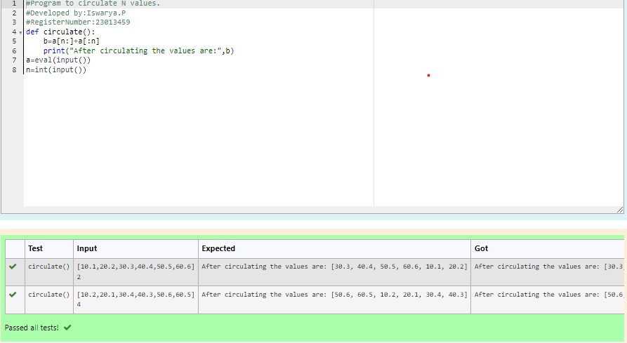

# Circulate-the-values-of-N-variables
## Aim:
To write a python program to circulate the n variables using function concept
## Equipment’s required:
PC
Anaconda - Python 3.7
## Algorithm: 
### Step 1: 
Use the function circulate.
### Step 2: 
Assign variables into list.
### Step 3: 
Get the value from the user for the number of rotation
### Step 4: 
Using the slicing concept rotate the list
### Step 5: 
Print the result.
### Step 6: 
End the program.
## Program:
```
#Program to circulate N values.
#Developed by:Iswarya.P 
#RegisterNumber:23013459
def circulate():
    b=a[n:]+a[:n]
    print("After circulating the values are:",b)
a=eval(input())
n=int(input())
```
## Output:


## Result:
The above python program to circulate the n variables using function concept.
